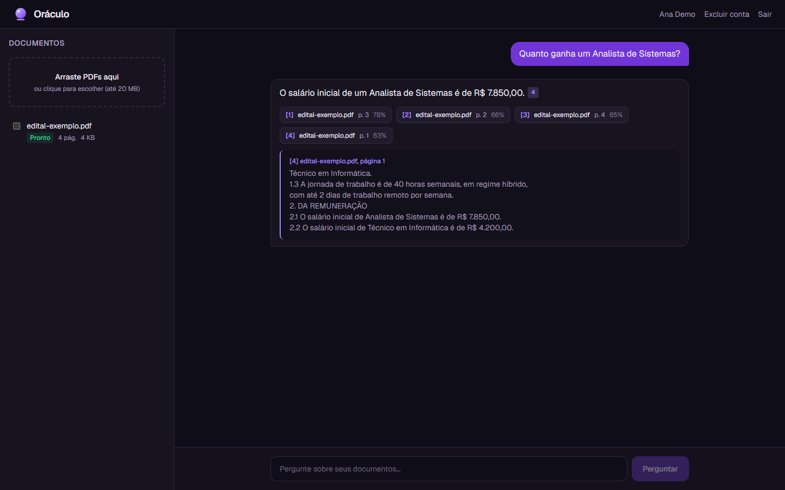
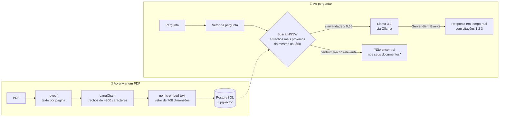
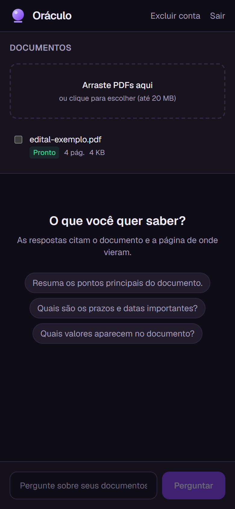
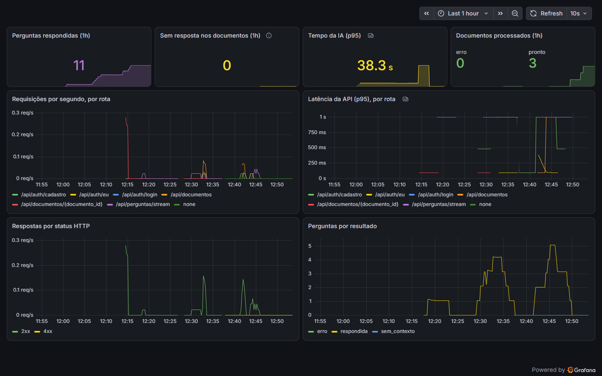

<h1 align="center">🔮 Oráculo</h1>

<p align="center">
  <b>Pergunte aos seus documentos.</b> Envie PDFs e faça perguntas em português:<br>
  a IA responde <b>citando o documento e a página</b> de onde tirou cada informação.
</p>

<p align="center">
  <a href="../../actions/workflows/ci.yml"></a>
  
  
  
  
  
  
  
  
</p>

<p align="center">
  
</p>

---

## O problema

Edital de concurso, contrato, regulamento, manual técnico: a resposta está lá, mas no meio de 80 páginas. Um chat de IA comum responde rápido, mas **inventa** quando não sabe, e não diz de onde tirou a informação.

O Oráculo usa **RAG (Retrieval-Augmented Generation)**: antes de responder, ele busca nos *seus* documentos os trechos que tratam da pergunta e entrega só esses trechos ao modelo, com a ordem de responder apenas com base neles e citar a fonte. Se nenhum trecho tratar do assunto, ele diz que não encontrou, sem inventar.

## Como funciona



Tudo roda **localmente**, com modelos abertos no Ollama: os documentos nunca saem da máquina e não há custo por pergunta.

## Stack

| Área | Tecnologias |
|---|---|
| 🤖 **IA** | RAG · LangChain · Ollama · Llama 3.2 · nomic-embed-text · embeddings · busca vetorial (pgvector + HNSW) · engenharia de prompt |
| ⚙️ **Back-end** | Python 3.14 · FastAPI · Pydantic · SQLAlchemy 2 · Alembic · PostgreSQL · Redis · JWT · Argon2 |
| 🎨 **Front-end** | TypeScript · Next.js 16 · React 19 · Tailwind CSS 4 · streaming com `fetch` + `ReadableStream` |
| ✅ **Qualidade** | pytest · Testcontainers · Vitest · Testing Library · Ruff · mypy (strict) · ESLint |
| 🚀 **DevOps** | Docker (multi-stage, sem root) · Docker Compose · nginx · GitHub Actions (CI/CD) · GHCR · Kubernetes + Kustomize · HPA · NetworkPolicy · Prometheus · Grafana · Dependabot · osv-scanner |

## Decisões técnicas

As escolhas que mais pesaram no resultado, e o porquê de cada uma.

**1. Trechos divididos página por página.** O texto do PDF é dividido em trechos dentro de cada página, e nunca atravessando duas. Custa um pouco de contexto nas bordas, mas a citação "p. 3" fica sempre exata, e é ela que deixa o usuário conferir a resposta.

**2. Tamanho do trecho e limite de similaridade medidos, e não chutados.** O primeiro teste com o modelo real errou uma citação: o salário estava na p. 1, e a resposta citou a p. 4. Com trechos de 1000 caracteres, cada página virava um trecho só, misturando assuntos. Em vez de trocar o número no escuro, escrevi uma [avaliação](#avaliação-da-busca) com perguntas de resposta conhecida, e os valores do `config.py` saíram dela. Trechos que não passam do limite mínimo são descartados; se nenhum passar, a API responde "não encontrei" sem chamar o modelo.

**3. O filtro por usuário fica dentro da busca vetorial.** O `WHERE usuario_id = ...` está na mesma consulta SQL que ordena por distância, e não num filtro em Python depois. Um trecho de outro usuário nunca chega perto do prompt. Isso tem uma armadilha: o índice HNSW acha os vizinhos mais próximos *antes* de aplicar o filtro e, com muitos usuários, poderia voltar vazio. Por isso a consulta liga a busca iterativa do pgvector 0.8 (`hnsw.iterative_scan`), que continua procurando até completar o resultado.

**4. Prefixos de tarefa no modelo de embeddings.** O `nomic-embed-text` foi treinado com `search_document:` nos textos e `search_query:` nas perguntas. Pergunta e resposta raramente usam as mesmas palavras, e os prefixos colocam os dois no mesmo espaço. É uma linha de código que melhora a busca de forma visível.

**5. Defesa contra prompt injection.** O texto de um PDF pode conter "ignore as instruções anteriores". O prompt separa as instruções (mensagem de sistema) dos trechos e diz explicitamente que o conteúdo dos trechos é dado, não ordem. Na interface, só vira link de citação um número que corresponde a uma fonte real: um `[7]` inventado aparece como texto comum.

**6. Streaming com Server-Sent Events, lido por `fetch`.** O modelo em CPU leva dezenas de segundos para terminar. Com streaming, a resposta aparece palavra por palavra. O `EventSource` do navegador só faz `GET`, e a pergunta vai no corpo de um `POST`, então a interface lê o stream com `fetch` e um parser próprio, testado inclusive para eventos que chegam quebrados entre dois pacotes de rede. No caminho, o nginx está com `proxy_buffering off`, senão juntaria a resposta inteira antes de entregar.

**7. A conexão com o banco é devolvida antes do stream começar.** A busca dos trechos termina e encerra a transação antes de o modelo começar a escrever. Uma resposta de 40 segundos não segura uma conexão do pool durante 40 segundos.

**8. Interface como arquivos estáticos.** A interface roda inteira no navegador, então o Next.js gera HTML, CSS e JS estáticos (`output: "export"`) e o mesmo nginx que faz o proxy da API serve os arquivos. A imagem final tem ~80 MB, roda sem root e não tem servidor Node em produção.

**9. Migração segura com várias réplicas.** Cada réplica da API roda `alembic upgrade` ao subir. No Kubernetes, duas réplicas sobem juntas e tentariam criar a mesma tabela ao mesmo tempo. Uma *advisory lock* do Postgres faz a segunda esperar a primeira terminar.

## Avaliação da busca

[`backend/avaliacao/avaliar_busca.py`](backend/avaliacao/avaliar_busca.py) roda 12 perguntas de resposta conhecida sobre o [edital de exemplo](docs/exemplos/edital-exemplo.pdf) (fictício) e 4 perguntas sem relação com ele, usando o modelo de embeddings real:

| Tamanho do trecho | Página certa em 1º | Página certa no top 3 | Menor nota do trecho certo | Maior nota sem relação |
|---|---|---|---|---|
| 1000 caracteres | 9 de 12 | 10 de 12 | 0,575 | 0,619 |
| 500 caracteres | 10 de 12 | 11 de 12 | 0,575 | 0,619 |
| 400 caracteres | 10 de 12 | 11 de 12 | 0,617 | 0,629 |
| **300 caracteres** ✅ | **11 de 12** | **11 de 12** | 0,609 | 0,615 |

O que os números mostraram:

- **Trechos menores acertam mais.** Com 300 caracteres, cada trecho trata de um assunto só, e o vetor dele fica mais "nítido". Também deixa o prompt curto, o que pesa muito para um modelo rodando em CPU.
- **Nenhum limite fixo separa "tem resposta" de "não tem".** A pergunta sem relação com nota mais alta (0,615) passou da pergunta certa com nota mais baixa (0,609). Por isso o limite (0,55) só descarta o que claramente não tem relação, e a decisão final de dizer "não encontrei" fica com o modelo, instruído no prompt. No teste real, ele acertou essa decisão.
- **O próximo passo tem dado para justificar:** um *reranker* (modelo que compara pergunta e trecho juntos) dá notas bem mais separadas que a similaridade de embeddings. Está em [Próximos passos](#próximos-passos).

## Segurança

Resumo abaixo; detalhes, limites conhecidos e como relatar uma falha em [SECURITY.md](SECURITY.md).

- **Sessão em cookie `httpOnly` + `Secure` + `SameSite=Strict`**, e não no `localStorage`: um script injetado na página (XSS) não consegue ler o token, e outro site não consegue fazer requisições em nome do usuário (CSRF).
- Senhas com **Argon2id**; login com tempo constante (e-mail inexistente e senha errada levam o mesmo tempo e têm a mesma resposta, sem revelar quem tem conta).
- **JWT** com algoritmo fixado na validação (sem o ataque `alg: none`) e chave obrigatória de pelo menos 32 bytes, sem valor padrão no código.
- **Limites contra abuso**: tentativas de login por e-mail e por IP, cadastros por IP, perguntas por minuto, páginas por PDF e documentos por usuário. Os contadores ficam no Redis para valer igual entre réplicas, e o nginx tem um limite próprio nas rotas de login.
- Upload validado pela **assinatura do arquivo** (`%PDF-`), e não pela extensão; nome do arquivo sem caminho nem caracteres de controle.
- **Nada de dado pessoal em erro ou log**: a resposta 422 não devolve o que foi digitado (a senha não volta), e o log registra só o tipo do erro, nunca texto de documento ou pergunta.
- **LGPD**: o usuário exclui a própria conta, com documentos e vetores, confirmando a senha. A IA roda localmente: nenhum documento sai da máquina.
- Documento de outro usuário responde **404, e não 403**, para não confirmar que o id existe; ids são UUID, não sequenciais.
- **Cabeçalhos de segurança** no nginx (CSP, `Permissions-Policy`, `nosniff`, `frame-ancestors 'none'`); `/metrics` e `/docs` não são publicados para fora.
- Containers **sem root**, com `no-new-privileges`, `cap_drop: ALL` e disco somente leitura; a interface só aceita conexões do próprio computador (`127.0.0.1`). No Kubernetes: Pod Security `restricted`, **NetworkPolicy** que só deixa a API falar com o banco, e TLS no Ingress.
- CI com **actions fixadas por SHA**, permissões mínimas no token, varredura de vulnerabilidades (osv-scanner) que bloqueia o merge e Dependabot semanal.

## Rodando

Precisa só de **Docker**. Na primeira vez, o Ollama baixa os modelos (~2,3 GB).

```bash
git clone https://github.com/nicole21carvalho/oraculo.git
cd oraculo
cp .env.example .env
# preencha ORACULO_JWT_SECRET e DB_PASSWORD no .env (os comandos estão no arquivo)
docker compose up -d
```

Abra **http://localhost:3000**, crie uma conta e envie um PDF.

Para ver o painel de monitoramento: `docker compose --profile monitoramento up -d` e abra **http://localhost:3001** (Grafana) ou **http://localhost:9090** (Prometheus).

> ⏱️ **Tempo de resposta:** sem placa de vídeo, numa CPU de notebook com 4 núcleos, a primeira palavra leva de 30 s a 1 min com o `llama3.2:3b`. Com GPU, 1 a 2 s. Com pouca memória ou sem paciência, use o modelo menor: `ORACULO_MODELO_CHAT=llama3.2:1b` no `.env`.

<p align="center">
  
  &nbsp;
  
</p>

<details>
<summary><b>Desenvolvimento local, sem Docker na API e na interface</b></summary>

```bash
# Banco, Redis e Ollama no Docker
docker compose up -d db redis ollama ollama-modelos

# API (http://localhost:8000/docs)
cd backend
uv sync
export ORACULO_JWT_SECRET="$(openssl rand -base64 48)"
export ORACULO_DATABASE_URL="postgresql+psycopg://oraculo:<DB_PASSWORD>@localhost:5432/oraculo"
uv run alembic upgrade head
uv run uvicorn oraculo.main:app_padrao --factory --reload

# Interface (http://localhost:3000)
cd frontend
npm install
npm run dev
```

Para acessar o banco e o Redis a partir da máquina, publique as portas deles num `docker-compose.override.yml`.
</details>

### Testes

```bash
cd backend && uv run pytest                 # 31 testes; sobe um Postgres + pgvector real (Testcontainers)
cd frontend && npm test                     # 8 testes (Vitest + Testing Library)
```

Os testes do back-end usam um banco de verdade, e não um banco em memória, porque a busca depende do operador de distância e do índice HNSW do pgvector. Os modelos de IA são substituídos por versões falsas e determinísticas: o teste não depende de rede e dá sempre o mesmo resultado.

## API

Documentação interativa (Swagger) em `/docs` quando a API roda localmente.

| Método | Rota | O que faz |
|---|---|---|
| `POST` | `/api/auth/cadastro` | Cria a conta e abre a sessão (cookie) |
| `POST` | `/api/auth/login` | Entra e abre a sessão (cookie) |
| `POST` | `/api/auth/sair` | Encerra a sessão |
| `GET` | `/api/auth/eu` | Dados do usuário logado |
| `POST` | `/api/auth/excluir-conta` | Apaga a conta, os documentos e os vetores (pede a senha) |
| `POST` | `/api/documentos` | Envia um PDF (responde `202`; o processamento continua em segundo plano) |
| `GET` | `/api/documentos` | Lista os documentos e o status de cada um |
| `DELETE` | `/api/documentos/{id}` | Apaga o documento e seus vetores |
| `POST` | `/api/perguntas` | Pergunta e recebe a resposta completa com as fontes |
| `POST` | `/api/perguntas/stream` | Mesma coisa, em tempo real (Server-Sent Events) |
| `GET` | `/api/saude` · `/api/saude/pronto` | Liveness e readiness, usados pelo Kubernetes |

## Estrutura

```
oraculo/
├── backend/                 API em Python
│   ├── src/oraculo/
│   │   ├── rag.py           busca vetorial, prompt e resposta com citações
│   │   ├── ingestao.py      leitura do PDF, divisão em trechos, embeddings
│   │   ├── ia.py            modelos via interfaces do LangChain
│   │   ├── seguranca.py     Argon2, JWT em cookie e limite de uso no Redis
│   │   └── rotas/           auth, documentos, perguntas, saúde
│   ├── migracoes/           Alembic (schema, índice HNSW)
│   ├── avaliacao/           avaliação da busca com perguntas de resposta conhecida
│   └── tests/               pytest + Testcontainers
├── frontend/                Next.js + TypeScript + Tailwind
│   ├── src/lib/sse.ts       leitor de Server-Sent Events
│   ├── src/components/      painel de documentos, conversa, citações
│   └── nginx.conf           serve a interface e faz proxy da API
├── infra/
│   ├── k8s/                 Kubernetes com Kustomize
│   ├── prometheus/          coleta e regras de alerta
│   └── grafana/             painel como código
├── docs/                    PDF de exemplo e prints
├── .github/workflows/       CI/CD
└── docker-compose.yml
```

## Próximos passos

- **OCR** para PDFs digitalizados (hoje eles são recusados com uma mensagem clara).
- **Reranking** dos trechos com um modelo *cross-encoder* antes de enviar ao LLM. A [avaliação](#avaliação-da-busca) mostrou que a similaridade de embeddings sozinha não separa bem as perguntas com e sem resposta.
- **Avaliação no CI**, com mais documentos e também a resposta final (não só a busca), para que uma mudança no prompt ou no tamanho do trecho que piore o resultado quebre o build.
- Provedor de nuvem (OpenAI, Anthropic) como opção, com consentimento do usuário. A API já fala só com as interfaces do LangChain, então a troca fica na fábrica em `ia.py`.

---

<p align="center">
  Feito por <a href="https://github.com/nicole21carvalho">@nicole21carvalho</a>
</p>
